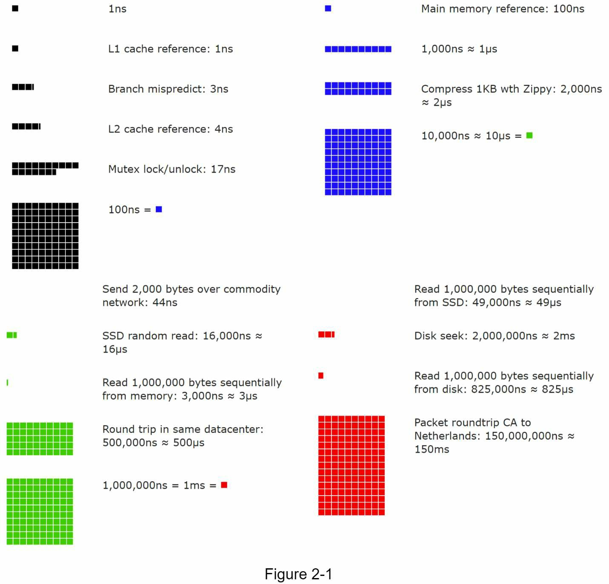

## 粗略评估

在系统设计面试中，有时你会被要求用粗略评估系统容量或性能要求。根据 Google 高级研究员 Jeff Dean 的说法，"粗略计算是你使用思想实验和常见的性能数字的组合来创建的估计，以很好地感觉到哪些设计可以满足你的要求"

你需要对可扩展性的基础知识有一个很好的感觉，以便有效地进行粗略计算。你需要好地理解以下概念：二的幂，每个程序员都应该知道的延迟数字，以及可用性数字。

### 2 的幂

尽管在处理分布式系统时，数据量可能变得巨大，但计算都可以归结为基础知识。为了获得正确的计算结果，关键是要知道使用 2 的幂的数据量单位。一个字节是一个 8 位的序列。一个 ASCII 字符使用一个字节的内存（8 比特）。下面是一个解释数据量单位的表格

| Power | Approximate value | Full name  | Short name |
| ----- | ----------------- | ---------- | ---------- |
| 10    | 1 Thousand        | 1 Kilobyte | 1 KB       |
| 20    | 1 Million         | 1 Megabyte | 1 MB       |
| 30    | 1 Billion         | 1 Gigabyte | 1 GB       |
| 40    | 1 Trillion        | 1 Terabyte | 1 TB       |
| 50    | 1 Quadrillion     | 1 Petabyte | 1 PB       |

### 每个程序都应该知道的延迟数字

来自谷歌的 Dr.Dean 展示了 2010 年典型计算机操作的时间长度。随着计算机变得更快、更强大，有些数字已经过时了。然而，这些数字应该仍然能够让我们了解不同计算机操作的快慢。

| Operation name                                  | Time                    |
| ----------------------------------------------- | ----------------------- |
| L1 cache reference                              | 0.5 ns                  |
| Branch mispredict                               | 5 ns                    |
| L2 cache reference                              | 7 ns                    |
| Mutex lock/unlock                               | 100 ns                  |
| Main memory reference                           | 100 ns                  |
| Compress 1K bytes with Zippy                    | 10,000 ns = 10 us       |
| Send 2K bytes over 1 Gbps network               | 20,000 ns = 20 us       |
| Read 1 MB sequentially from memory              | 250,000 ns = 250 us     |
| Round trip within the same datacenter           | 500,000 ns = 500 us     |
| Disk seek                                       | 10,000,000 ns = 10 ms   |
| Read 1 MB sequentially from the network         | 10,000,000 ns = 10 ms   |
| Read 1 MB sequentially from disk                | 30,000,000 ns = 30 ms   |
| Send packet CA (California) -> Netherlands-> CA | 150,000,000 ns = 150 ms |

一位谷歌软件工程师建立了一个工具，将 Dr.Dean 的数字可视化。该工具还将时间因素考虑在内。下图显示了截至 2020 年的可视化延迟数字

- 内存很快，但磁盘很慢。
- 如果可能的话，要避免磁盘搜索。
- 简单的压缩算法是快速的。
- 如果可能的话，在通过互联网发送数据之前先进行压缩。
- 数据中心通常在不同地区，在它们之间发送数据需要时间。

### 可用性

高可用性是指一个系统在一个理想的长时期内持续运行的能力。高可用性是以百分比来衡量的，100%意味着一个服务没有停机时间。大多数服务在 99%和 100%之间。

服务水平协议（SLA）是服务提供者的一个常用术语。这是你（服务提供商）和你的客户之间的协议，这个协议正式定义了你的服务将提供的正常运行时间水平。云服务提供商亚马逊、谷歌和微软将其 SLA 设定为 99.9% 或以上。正常运行时间传统上是以 9 的个数为单位衡量的。9 个数多，越好。如下表所示，9 的个数与预期系统停机时间相关。

| Availability % | Downtime per day    | Downtime per year |
| -------------- | ------------------- | ----------------- |
| 99%            | 14.40 minutes       | 3.65 days         |
| 99.9%          | 1.44 minutes        | 8.77 hours        |
| 99.99%         | 8.64 seconds        | 52.60 minutes     |
| 99.999%        | 864.00 milliseconds | 5.26 minutes      |
| 99.9999%       | 86.40 milliseconds  | 31.56 seconds     |

### 例子:评估 Twitter 的 QPS 和存储需求

请注意，以下数字仅用于本练习，因为它们不是 Twitter 的真实数字。

- 假设。
  - 每月有 3 亿活跃用户。
  - 50%的用户每天使用 Twitter。
  - 用户平均每天发布 2 条推文。
  - 10%的推文包含媒体。
  - 数据存储时间为 5 年。估算。
- 每秒查询次数（QPS）估计。
  - 日活跃用户（DAU）=3 亿\*50%=1.5 亿
  - 推文 QPS = 1.5 亿 \* 2 条推文/24 小时/3600 秒 = ~3500
  - Peek QPS = 2 \* QPS = ~7000
- 我们在此只估算媒体存储量。
  - 平均推文大小。
    - tweet_id 64 bytes
    - 文本 140 字节
    - 媒体 1 MB
  - 媒体存储。1.5 亿*2*10%\*1MB=30TB/天
  - 5 年的媒体存储。30 TB \* 365 \* 5 = ~55 PB

### 技巧

粗略估计是关于过程的。解决问题比获得结果更重要。面试官可能会测试你解决问题的能力。这里有几个技巧可以借鉴。

- 四舍五入和近似。在面试中很难进行复杂的数学运算。例如，"99987 / 9.1 "的结果是什么？没有必要花费宝贵的时间来解决复杂的数学问题。精度不被期待。使用整数和近似值对你有利。这个除法问题可以简化如下。"100,000 / 10".
- 写下你的假设。写下你的假设是个好主意，以便以后参考。
- 标记你的单位。当你写下 "5 "时，它是指 5KB 还是 5MB？你可能会因此而迷惑自己。写下单位，因为 "5 MB "有助于消除歧义。
- 常见的粗略估算法。QPS，峰值 QPS，存储，缓存，服务器的数量，等等。你可以在准备面试的时候练习这些计算方法。实践出真知。

恭喜你走到这一步! 现在给自己拍拍背吧。干得好!
