## 设计一个限流器

在网络系统中，限流器被用来控制客户端或服务所发送的流量速率。在 HTTP 世界中，限流器限制了允许在指定时间内发送的客户端请求的数量。如果 API 请求数超过了限流器定义的阈值，所有多余的调用都会被阻止。这里有几个例子。

- 一个用户每秒钟可以写不超过 2 个帖子。
- 你每天最多可以从同一个 IP 地址创建 10 个账户。
- 你每周从同一设备上领取奖励的次数不能超过 5 次。

在本章中，要求你设计一个限流器。在开始设计之前，我们首先看一下使用 API 限流器的好处。

- 防止由拒绝服务（DoS）攻击引起的资源饥饿。几乎所有大型科技公司发布的 API 都执行了某种形式的限流。例如，Twitter 将每 3 小时的推文数量限制为 300 条。Google docs APIs 有如下默认限制：每个用户每 60 秒读取请求 300 次。限流器通过阻止多余的调用来防止 DoS 攻击，无论是有意的还是无意的。
- 降低成本。限制多余的请求意味着更少的服务器和分配更多的资源分配给高优先级的 API。限流对于使用付费的第三方 API 的公司极为重要。例如，你对以下外部 API 的调用是按次数收费的：检查信用、付款、检索健康记录等。限制调用次数是降低成本的关键。
- 防止服务器过载。为了减少服务器的负荷，使用限流器来过滤掉由机器人或用户的不当行为造成的过多请求。

### 理解问题并确定设计范围

限流可以通过不同的算法来实现，每一种算法都有其优点和缺点。面试官和候选人之间的互动有助于澄清我们要建立的限流器的类型。

候选人：我们要设计什么样的限流器？是客户端的限流器还是服务器端的 API 限流器？  
面试官：好问题。我们的重点是服务器端的 API 限流器。  
候选人：限流器是根据 IP、用户 ID 还是其他属性来节制 API 请求？  
面试官：限流器应该足够灵活，以支持不同的节流规则。  
应聘者：系统的规模是多少？它是为初创公司还是拥有庞大用户群的大公司建立的？  
面试官：系统必须能够处理大量的请求。  
应聘者：系统能否在分布式环境中工作？  
面试官：是的。  
应聘者：限流器是一个单独的服务还是应该在应用程序代码中实现？  
面试官：是的。这是一个由你决定的设计。  
应聘者：我们是否需要通知那些被限制的用户？  
面试官：是的。

需求:

- 以下是对该系统要求的总结。
  - 准确地限制过多的请求。
  - 低延时。限流器不应该减慢 HTTP 响应时间。
  - 尽可能少地使用内存。
  - 分布式限流。限流器可以在多个服务器或进程中共享。
  - 异常处理。当用户的请求被节制时，向用户显示明确的异常。
  - 高容错性。如果限流器有任何问题（例如，一个缓存服务器离线），它不会影响整个系统。

### 提出高层次的设计并获得认同

让我们保持简单，使用基本的客户和服务器模式进行通信。

把限流器放在哪里？

直观地说，你可以在客户端或服务器端实现一个限流器。

- 客户端实现。一般来说，客户端是执行限流的一个不可靠的地方，因为客户端的请求很容易被恶意的人伪造。此外，我们可能无法控制客户端的实现。
- 服务器端的实现。图 4-1 显示了一个放在服务器端的限流器。

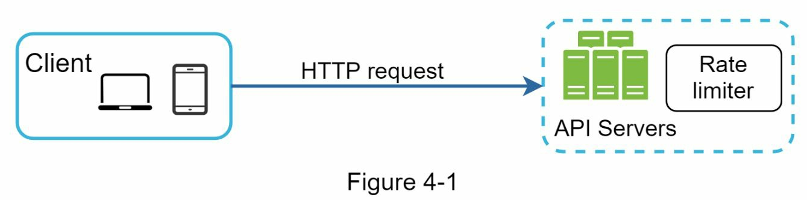

除了客户端和服务器端的实现，还有一种替代方法。我们不在 API 服务器上设置限流器，而是创建一个限流器中间件，它可以节制对你的 API 的请求，如图 4-2 所示。

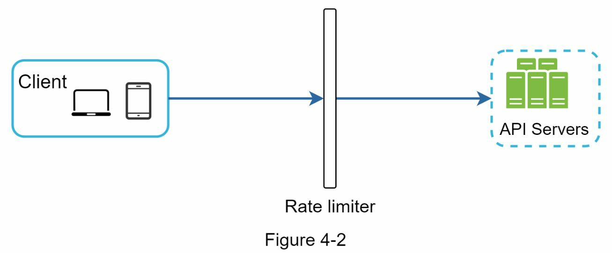

让我们用图 4-3 中的一个例子来说明限流在这个设计中的作用。假设我们的 API 允许每秒 2 个请求，而一个客户在一秒钟内向服务器发送了 3 个请求。前两个请求被路由到 API 服务器。然而，限流器中间件会对第三个请求进行节流，并返回一个 HTTP 状态代码 429。HTTP 429 响应状态代码表明用户发送了太多的请求。

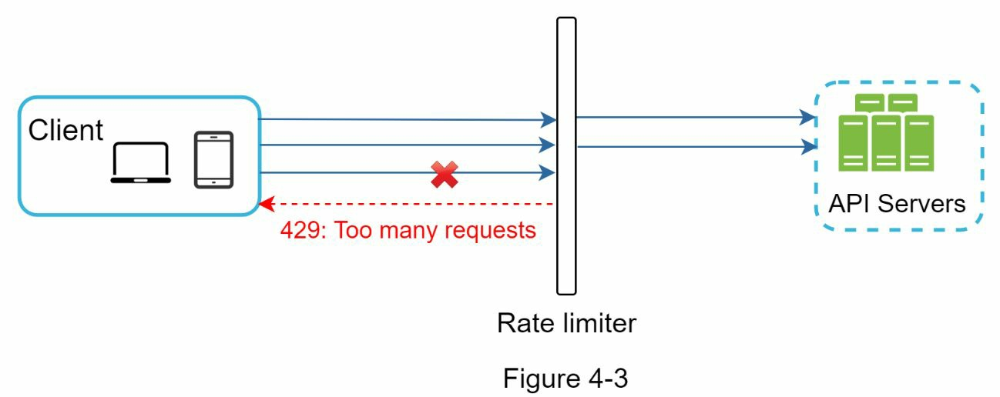

云微服务已经广泛流行，限流通常在一个叫做 API 网关的组件中实现。API 网关是一个完全可管理的服务，支持限流、SSL 终止、认证、IP 白名单、服务静态内容等。现在，我们只需要知道，API 网关是一个支持限流的中间件。

在设计限流器时，要问自己的一个重要问题是：限流器应该在哪里实现，在服务器端还是在网关中？这没有绝对的答案。这取决于你公司目前的技术栈、工程资源、优先级、目标等。这里有一些一般的指导方针。

- 评估你目前的技术栈，如编程语言、缓存服务等。确保你目前的编程语言能够有效地在服务器端实现限流。
- 确定适合你的业务需求的限流算法。当你在服务器端实现一切时，你可以完全控制算法。然而，如果你使用第三方网关，你的选择可能是有限的。
- 如果你已经使用了微服务架构，并在设计中包含了一个 API 网关来执行认证、IP 白名单等，你可以在 API 网关上添加一个限流器。
- 建立你自己的限流服务需要时间。如果你没有足够的

如果你没有足够的工程资源来实现一个限流器，商业 API 网关是一个更好的选择。

限流的算法

限流可以用不同的算法来实现，每一种算法都有明显的优点和缺点。尽管本章并不关注算法，但在高层次上了解它们有助于选择正确的算法或算法组合来适应我们的使用情况。下面是一个流行算法的列表。

- Token bucket
- Leaking bucket
- Fixed window counter
- Sliding window log
- Sliding window counter

Token bucket 算法

Token bucket 算法被广泛用于限流。它很简单，很好理解，并被互联网公司普遍使用。亚马逊和 Stripe 都使用这种算法来限制他们的 API 请求。

Token bucket 算法的工作原理如下。

- Token bucket 是一个有预先定义的容量的容器。Token 以预设的速度定期放入桶中。一旦桶满了，就不再添加 Token。如图 4-4 所示，Token bucket 的容量为 4，补给者每秒钟向桶中投入 2 个 Token。一旦桶满了，多余的 Token 就会溢出。

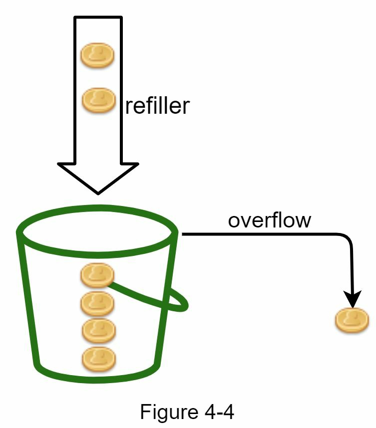

每个请求都会消耗一个 Token。当一个请求到达时，我们检查桶中是否有足够的 Token。图 4-5 解释了它是如何工作的。

- 如果有足够的 Token，我们为每个请求取出一个 Token，然后请求就会通过。
- 如果没有足够的 Token，则请求被放弃。

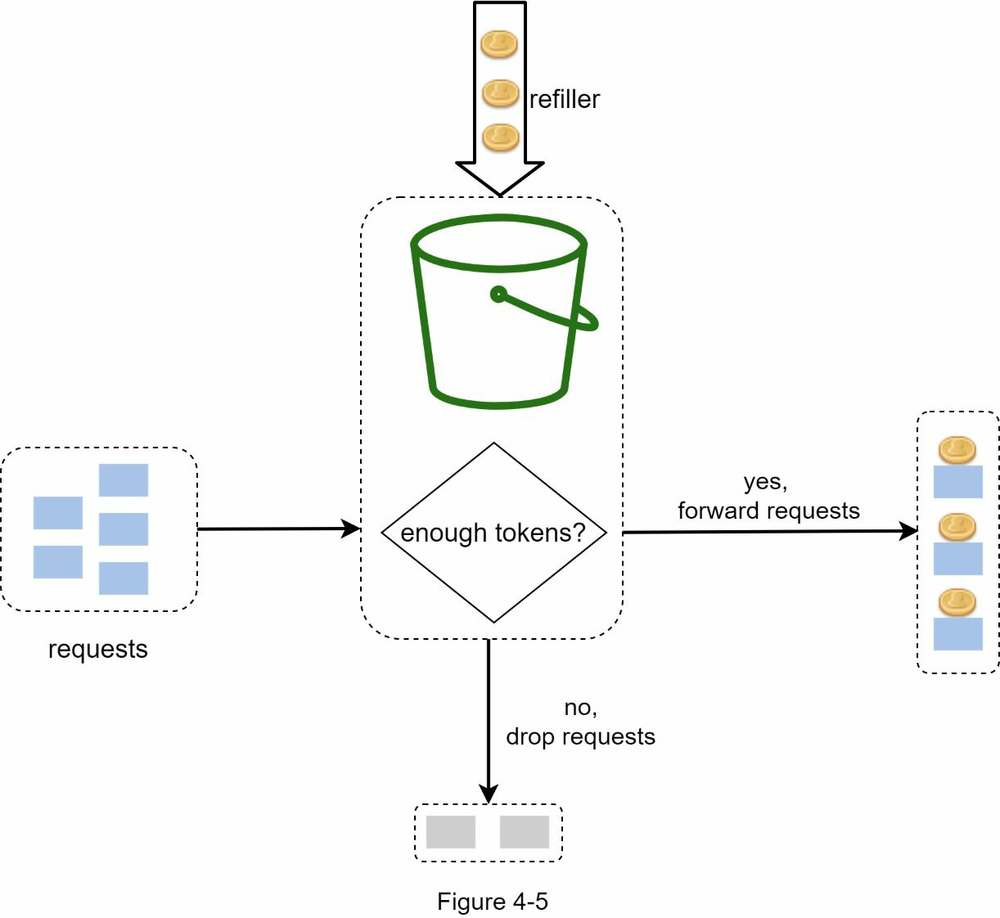

图 4-6 说明了 Token 消耗、再填充和限流逻辑是如何工作的。在这个例子中，Token bucket 的大小是 4，补给率是每 1 分钟 4 个。

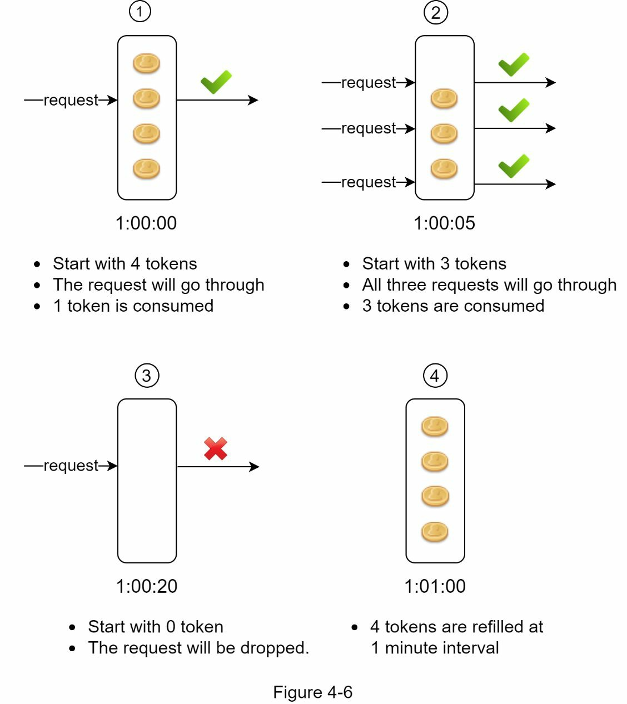

Token bucket 算法需要两个参数。

- 桶的大小：桶中允许的最大 Token 数量
- 填充率：每秒钟放入桶中的 Token 数量

我们需要多少个桶？这是不一样的，它取决于限流规则。这里有几个例子。

- 通常有必要为不同的 API 端点设置不同的桶。例如，如果一个用户被允许每秒发 1 个帖子，每天添加 150 个朋友，并且每秒喜欢 5 个帖子，那么每个用户需要 3 个桶。
- 如果我们需要根据 IP 地址来节制请求，每个 IP 地址需要一个桶。
- 如果系统允许每秒最多 10,000 个请求，那么有一个由所有请求共享的全球桶是有意义的。

优点。

- 该算法很容易实现。
- 内存高效。
- Token bucket 允许短时间内的流量突发。只要有剩余的令牌，请求就可以通过。

缺点。

- 算法中的两个参数是桶的大小和令牌填充率。然而，适当调整它们可能是一个挑战。

Leaking bucket 算法

Leaking bucket 算法与令牌桶类似，只是请求是以固定的速度处理的。它通常用先入先出（FIFO）队列来实现。该算法的工作原理如下。

- 当一个请求到达时，系统检查队列是否已满。如果队列未满，则将请求添加到队列中。
- 否则，该请求将被放弃。
- 请求被从队列中拉出并定期处理。

图 4-7 解释了该算法的工作原理。

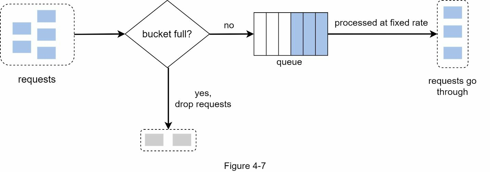

- Leaking bucket 算法需要以下两个参数。
  - 桶的大小：它等于队列大小。队列容纳了要以固定速率处理的请求。
  - 流出率：它定义了在一个固定的速率下可以处理多少个请求，通常以秒为单位。

Shopify，一家电子商务公司，使用 Leaking bucket 进行限流.

- 优点
  - 鉴于队列规模有限，内存效率高。
  - 请求以固定的速率处理，因此它适用于需要稳定流出速率的用例。
- 缺点
  - 突发的流量会使队列中的旧请求填满，如果它们没有被及时处理，最近的请求将被限制速率。
  - 该算法中有两个参数。要适当地调整它们可能并不容易。

Fixed window counter 算法

- Fixed window counter 算法的工作原理如下。
  - 该算法将时间线划分为固定大小的时间窗口，并为每个窗口分配一个计数器。
  - 每个请求都会使计数器增加一个。
  - 一旦计数器达到预定的阈值，新的请求就会被放弃，直到一个新的时间窗口开始。

让我们用一个具体的例子来看看它是如何工作的。在图 4-8 中，时间单位是 1 秒，系统允许每秒钟最多有 3 个请求。在每个时间窗口中，如果收到的请求超过 3 个，额外的请求会被丢弃，如图 4-8 所示。

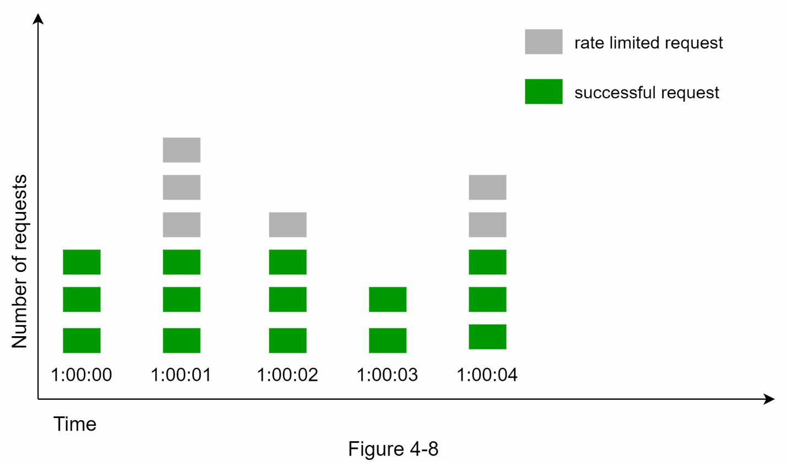

这种算法的一个主要问题是，在时间窗口边缘的流量突发可能导致超过允许配额的请求通过。考虑以下情况。

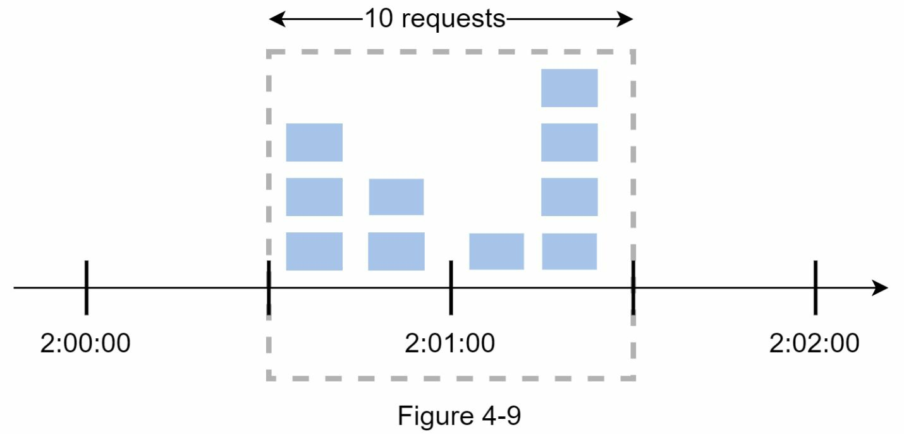

在图 4-9 中，系统允许每分钟最多有 5 个请求，可用配额在对人友好的整时重置。正如所见，在 2:00:00 和 2:01:00 之间有 5 个请求，在 2:01:00 和 2:02:00 之间还有 5 个请求。在 2:00:30 和 2:01:30 之间的 1 分钟窗口，有 10 个请求通过。这是允许的请求数的两倍。

- 优点。
  - 内存效率高
  - 易于理解
  - 在单位时间窗口结束时重新设置可用配额，适合某些使用情况。
- 缺点。
  - 窗口边缘的流量激增可能导致超过允许的配额的请求被通过。

Sliding window log 算法

如前所述，Fixed window counter 算法有一个主要问题：它允许更多的请求在窗口的边缘通过。Sliding window log 算法解决了这个问题。它的工作原理如下。

- 该算法对请求的时间戳进行跟踪。时间戳数据通常被保存在缓存中，比如 Redis 的排序集。
- 当一个新的请求进来时，删除所有过期的时间戳。过时的时间戳被定义为比当前时间窗口的开始时间更早的时间戳。
- 将新请求的时间戳添加到日志中。
- 如果日志的大小与允许的计数相同或更低，则接受请求。否则，它被拒绝。

我们用图 4-10 所示的一个例子来解释该算法。

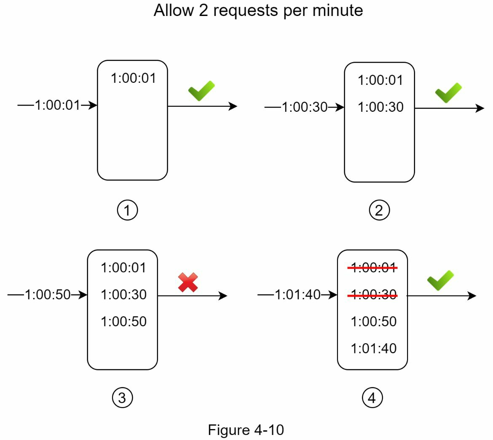

在这个例子中，限流器允许每分钟 2 个请求。通常情况下，Linux 的时间戳会存储在日志中。然而，在我们的例子中，为了提高可读性，使用了人类可读的时间表示。

- 当一个新的请求在 1:00:01 到达时，日志是空的。因此，该请求被允许。
- 一个新的请求在 1:00:30 到达，时间戳 1:00:30 被插入到日志中。插入后，日志大小为 2，不大于允许的数量。因此，该请求被允许。
- 一个新的请求在 1:00:50 到达，时间戳被插入到日志中。插入后，日志的大小是 3，大于允许的大小 2。因此，这个请求被拒绝，尽管时间戳仍然在日志中。
- 一个新的请求在 1:01:40 到达。在[1:00:40,1:01:40]范围内的请求是在最新的时间范围内，但在 1:00:40 之前发送的请求是过时的。两个过时的时间戳，1:00:01 和 1:00:30，被从日志中删除。在删除操作后，日志大小变成 2；因此，请求被接受。

- 优点。
  - 这个算法实现的限流是非常准确的。在任何滚动窗口中，请求都不会超过限流。
- 缺点。
  - 该算法消耗了大量的内存，因为即使一个请求被拒绝，它的时间戳仍然可能被存储在内存中。

Sliding window counter 算法

Sliding window counter 算法是一种混合方法，结合了 Fixed window counter 和 Sliding window log。该算法可以通过两种不同的方法来实现。我们将在本节中解释一种实现方法，并在本节末尾提供另一种实现方法的参考。图 4-11 说明了这种算法的工作原理。

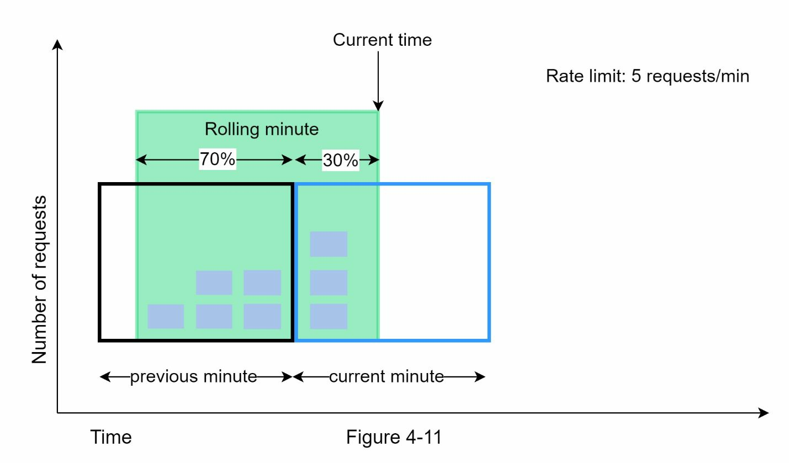

假设限流器允许每分钟最多 7 个请求，上一分钟有 5 个请求，当前一分钟有 3 个请求。对于一个在当前分钟内到达 30%位置的新请求，滚动窗口中的请求数用以下公式计算。

- 当前窗口中的请求+前一个窗口中的请求\*滚动窗口和前一个窗口的重叠百分比 - 使用这个公式，我们得到 3 + 5 \* 0.7% = 6.5 个请求。根据不同的使用情况，这个数字可以向上或向下取整。在我们的例子中，它被向下四舍五入为 6。

由于限流器允许每分钟最多有 7 个请求，所以当前的请求可以通过。然而，再收到一个请求后就会达到限制。

由于篇幅所限，我们在此不讨论其他的实现方法。有兴趣的读者可以参考参考资料。这种算法并不完美。它有优点和缺点。

- 优点
  - 因为速率是基于前一个窗口的平均速率，所以它可以平滑流量的高峰期。
  - 内存效率高。
- 缺点
  - 它只适用于不太严格的回看窗口。它是实际速率的近似值，因为它假定前一个窗口的请求是均匀分布的。然而，这个问题可能并不像它看起来那么糟糕。根据 Cloudflare 所做的实验，在 4 亿个请求中，只有 0.003%的请求被错误地允许或限流。

高层结构

限流算法的基本思想很简单。在高层次上，我们需要一个计数器来跟踪来自同一用户、IP 地址等的多少个请求。如果计数器大于限制值，请求就会被禁止。

我们应该在哪里存储计数器呢？由于磁盘访问速度慢，使用数据库并不是一个好主意。选择内存缓存是因为它速度快且支持基于时间的过期策略。例如，Redis 是实现限流的一个流行选择。它是一个内存存储，提供两个命令。INCR 和 EXPIRE。

- INCR：它使存储的计数器增加 1。
- EXPIRE：它为计数器设置一个超时。如果超时过后，计数器会被自动删除。

图 4-12 显示了限流的高层结构，其工作原理如下。

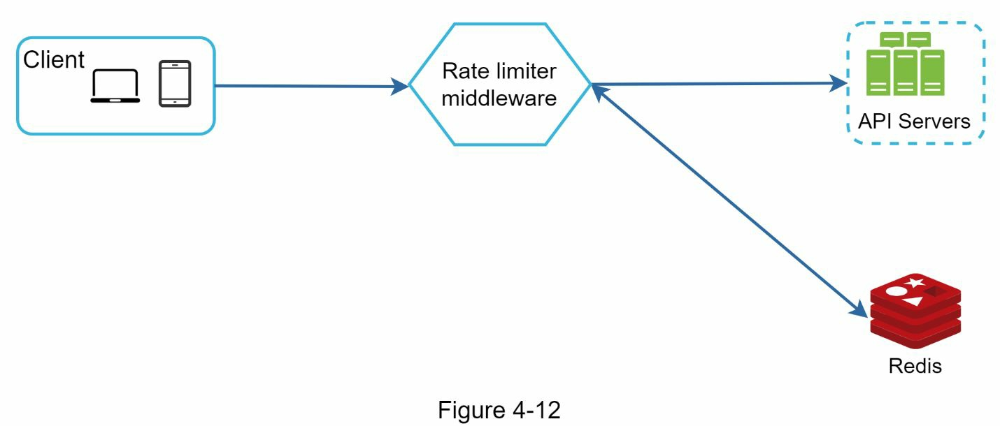

- 客户端向限流中间件发送一个请求。
- 限流中间件从 Redis 的相应桶中获取计数器，并检查是否达到限制。
- 如果达到了限制，请求被拒绝。
- 如果没有达到限制，请求被发送到 API 服务器。同时，系统增加计数器并将其保存到 Redis。

### 设计深究

图 4-12 中的高层设计并没有回答以下问题。

- 如何创建限流规则？规则存储在哪里？
- 如何处理受到限流的请求？

在这一节中，我们将首先回答关于限流规则的问题，然后介绍处理限流请求的策略。最后，我们将讨论分布式环境中的限流，一个详细的设计，性能优化和监控。

费率限制规则

Lyft 开源了他们的限流组件。我们将窥视该组件的内部，并查看一些限流规则的例子。

```yaml
domain: messaging
descriptors:
  - key: message_type
    Value: marketing
    rate_limit:
      unit: day
      requests_per_unit: 5
```

在上述例子中，系统被配置为每天最多允许 5 条营销信息。下面是另一个例子。

```yaml
domain: auth
descriptors:
  - key: auth_type
    Value: login
    rate_limit:
      unit: minute
      requests_per_unit: 5
```

这个规则显示，客户不允许在 1 分钟内登录超过 5 次。规则一般写在配置文件中并保存在磁盘上。

超出限流

如果一个请求有限流，API 会向客户端返回一个 HTTP 响应代码 429（请求太多）。根据不同的使用情况，我们可能会排队等待限流的请求，以便以后处理。例如，如果一些订单由于系统过载而受到限流，我们可能会保留这些订单以便以后处理。

限流器标题 客户端如何知道它是否被节流？客户端又如何知道在被节流前允许的剩余请求数？答案就在 HTTP 响应头中。限流器向客户端返回以下 HTTP 头。

X-Ratelimit-Remaining：窗口内允许的剩余请求数。
X-Ratelimit-Limit：它表示客户端在每个时间窗口内可以进行多少次呼叫。
X-Ratelimit-Retry-After：等待的秒数，直到可以再次发出请求而不被节流。

当用户发送了太多的请求时，会向客户端返回一个 429 太多请求的错误和 X-Ratelimit- Retry-After 标头。

详细设计

图 4-13 展示了系统的详细设计。

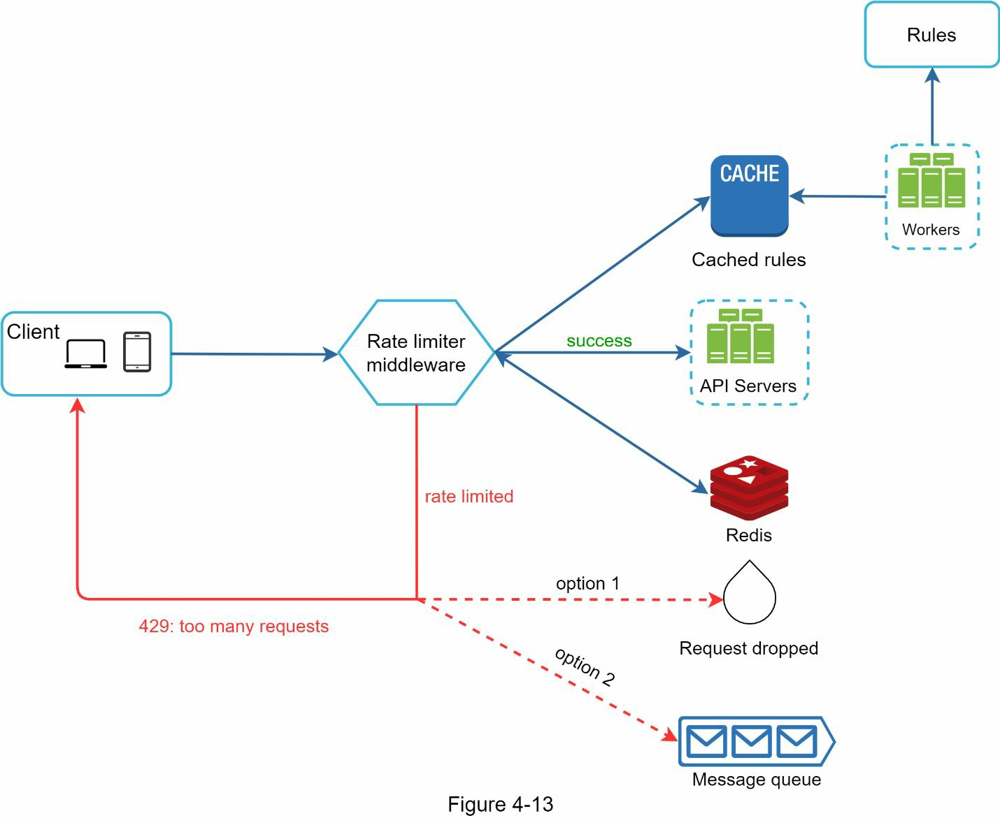

- 规则被存储在磁盘上。工作者经常从磁盘中提取规则并将其存储在缓存中。
- 当客户端向服务器发送请求时，该请求首先被发送到限流器中间件。
- 限流器中间件从缓冲区加载规则。它从 Redis 缓存中获取计数器和最后一次请求的时间戳。根据响应，限流器决定。
  - 如果请求没有限流，它将被转发到 API 服务器。
  - 如果请求有限流，限流器会向客户端返回 429 太多请求的错误。同时，该请求被放弃或转发到队列中。

分布式环境中的限流器

构建一个在单服务器环境下工作的限流器并不困难。然而，扩展系统以支持多个服务器和并发线程是一个不同的故事。这有两个挑战。

- 竞态条件
- 同步问题

竞态条件

如前所述，限流器在高层工作如下。

- 从 Redis 读取计数器的值。
- 检查( counter + 1 )是否超过了阈值。
- 如果没有，在 Redis 中把计数器的值增加 1。

如图 4-14 所示，在一个高度并发的环境中可能会发生竞态条件。

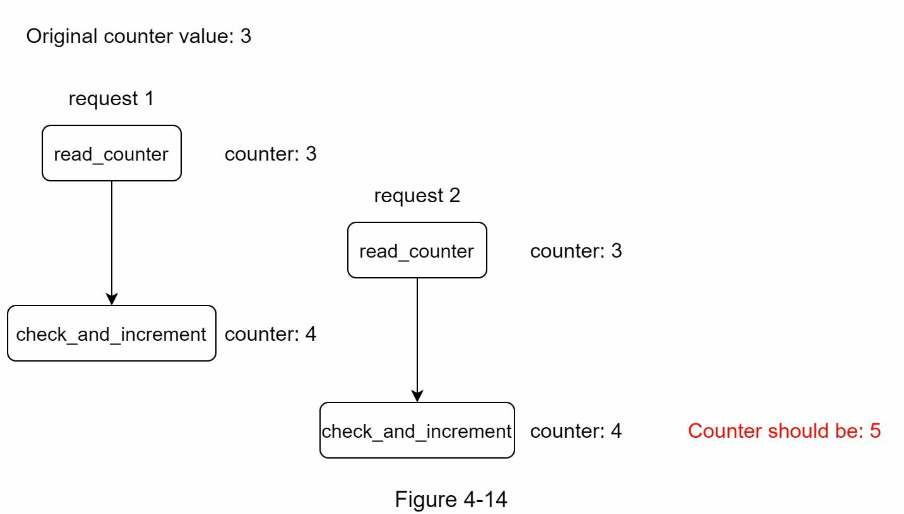

假设 Redis 中的计数器值是 3。如果两个请求在其中一个写回计数器值之前同时读取该值，每个请求都会将计数器增量为 1，然后写回，而不检查其他线程。两个请求（线程）都认为他们有正确的计数器值 4。然而，正确的计数器值应该是 5。

锁是解决竞赛条件的最明显的解决方案。然而，锁将大大降低系统的速度。有两种策略通常被用来解决这个问题：Lua 脚本和 Redis 中的排序集数据结构。对这些策略感兴趣的读者可以参考相应的参考资料。

同步问题 同步是分布式环境中需要考虑的另一个重要因素。为了支持数以百万计的用户，一个限流器服务器可能不足以处理这些流量。当使用多个限流器服务器时，需要进行同步。例如，在图 4-15 的左边，客户 1 向限流器 1 发送请求，客户 2 向限流器 2 发送请求。由于网络层是无状态的，客户可以向不同的限流器发送请求，如图 4-15 的右侧所示。如果没有发生同步，限流器 1 不包含任何关于客户端 2 的数据。因此，限流器不能正常工作。

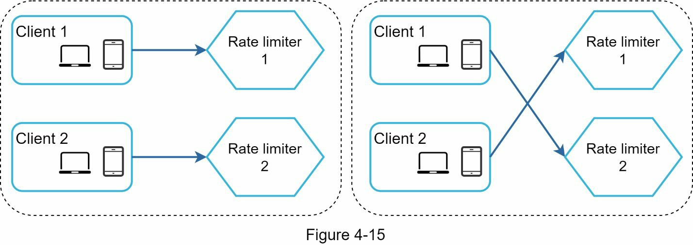
一个可能的解决方案是使用粘性会话，允许客户发送流量到同一个限流器。这种解决方案是不可取的，因为它既不具备可扩展性，也不具备灵活性。一个更好的方法是使用集中式数据存储，如 Redis。该设计如图 4-16 所示。
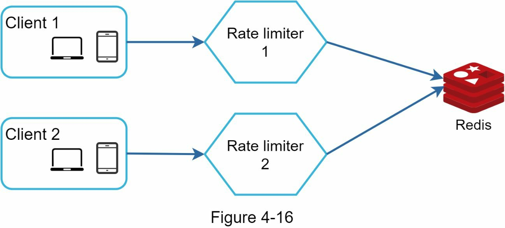

性能优化

性能优化是系统设计访谈中的一个常见话题。我们将涉及两个方面的改进。

首先，多数据中心的设置对于限流器来说是至关重要的，因为对于远离数据中心的用户来说，延迟很高。大多数云服务提供商在世界各地建立了许多边缘服务器位置。例如，截至 2020 年 5 月 20 日，Cloudflare 有 194 个地理上分布的边缘服务器。流量被自动路由到最近的边缘服务器以减少延迟。

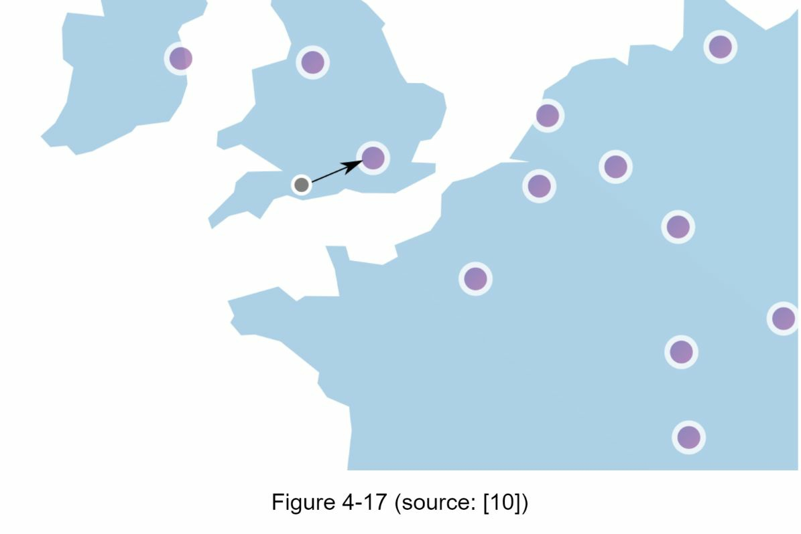

第二，用最终的一致性模型来同步数据。如果你不清楚最终的一致性模型，请参考 "第 6 章：设计键值存储 "中的 "一致性 "部分。

监控

限流器投入使用后，收集分析数据以检查限流器是否有效是很重要的。主要的是，我们要确保

- 限流算法是有效的。
- 限流规则是有效的。

例如，如果限流规则过于严格，许多有效的请求会被放弃。在这种情况下，我们想把规则放宽一点。在另一个例子中，我们注意到当流量突然增加时，我们的限流器变得无效，比如闪购。在这种情况下，我们可以更换算法来支持突发流量。Token bucket 在这里很适合。

### 总结

在这一章中，我们讨论了限流的不同算法及其利弊。讨论的算法包括。

- Token bucket
- Leaking bucket
- Fixed window
- Sliding window log
- Sliding window counter

然后，我们讨论了系统架构、分布式环境下的限流器、性能优化和监控。与任何系统设计的面试问题类似，如果时间允许，你还可以提到一些额外的谈话要点。

- 硬限流与软限流。
  - 硬：请求的数量不能超过阈值。
  - 软：请求可以在短时间内超过阈值。
- 不同级别的限流。在本章中，我们只谈到了应用层面的限流（HTTP：第 7 层）。也可以在其他层应用限流。例如，你可以使用 Iptables（IP：第 3 层）按 IP 地址应用限流。注意：开放系统互连模型（OSI 模型）有 7 层。第 1 层：物理层，第 2 层：数据链路层，第 3 层：网络层，第 4 层：传输层，第 5 层：会话层，第 6 层：表现层，第 7 层：应用层。
- 避免被限流。用最佳实践设计你的客户端。
  - 使用客户端缓存以避免频繁调用 API。
  - 理解限制，不要在短时间内发送太多的请求。
  - 包括捕捉异常或错误的代码，以便你的客户端可以从异常中优雅地恢复。
  - 添加足够的后退时间来重试逻辑。

祝贺你走到了这一步! 现在给自己拍拍屁股吧。干得好!

### 参考资料

[1][rate-limiting strategies and techniques](https://cloud.google.com/solutions/rate-limitingstrategies-techniques)  
[2][twitter rate limits](https://developer.twitter.com/en/docs/basics/rate-limits)  
[3][google docs usage limits](https://developers.google.com/docs/api/limits)  
[4][ibm microservices](https://www.ibm.com/cloud/learn/microservices)  
[5][throttle api requests for better throughput](https://docs.aws.amazon.com/apigateway/latest/developerguide/api-gateway-requestthrottling.html)  
[6][stripe rate limiters](https://stripe.com/blog/rate-limiters)  
[7][shopify rest admin api rate limits](https://help.shopify.com/en/api/reference/restadmin-api-rate-limits)  
[8][better rate limiting with redis sorted sets](https://engineering.classdojo.com/blog/2015/02/06/rolling-rate-limiter/)  
[9][system design — rate limiter and data modelling](https://medium.com/@saisandeepmopuri/system-design-rate-limiter-and-data-modelling9304b0d18250)  
[10][how we built rate limiting capable of scaling to millions of domains](https://blog.cloudflare.com/counting-things-a-lot-of-different-things/)  
[11][redis website](https://redis.io/)  
[12][lyft rate limiting](https://github.com/lyft/ratelimit)  
[13][scaling your api with rate limiters](https://gist.github.com/ptarjan/e38f45f2dfe601419ca3af937fff574d#request-rate-limiter)  
[14][what is edge computing](https://www.cloudflare.com/learning/serverless/glossary/whatis-edge-computing/)  
[15][rate limit requests with iptables](https://blog.programster.org/rate-limit-requests-withiptables)  
[16][osi model](https://en.wikipedia.org/wiki/OSI_model#Layer_architecture)  
